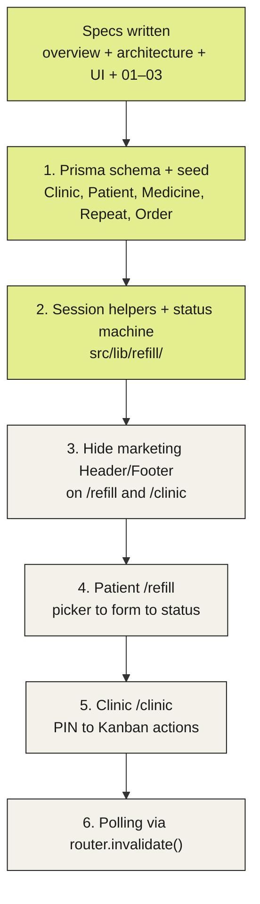
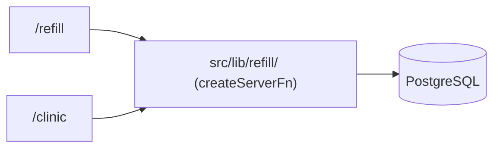
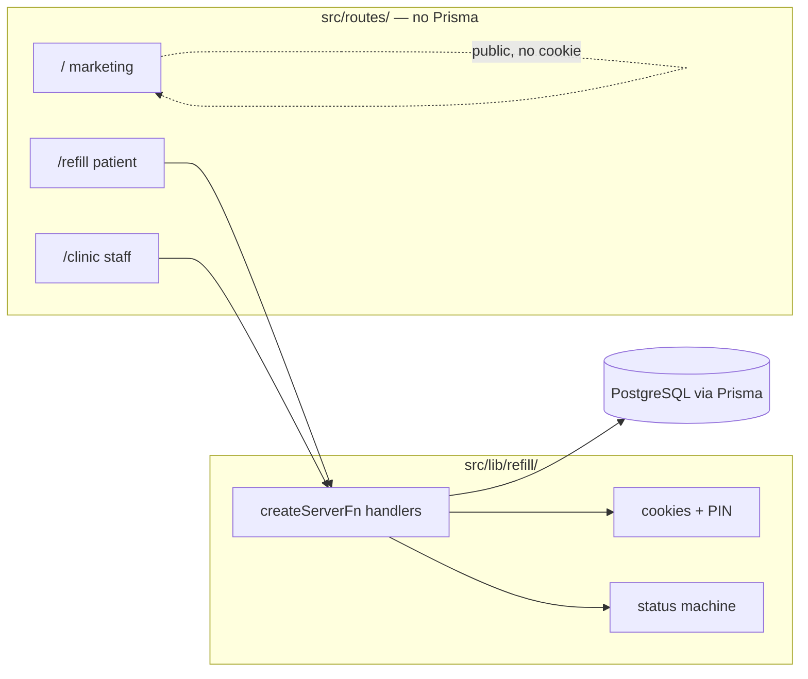
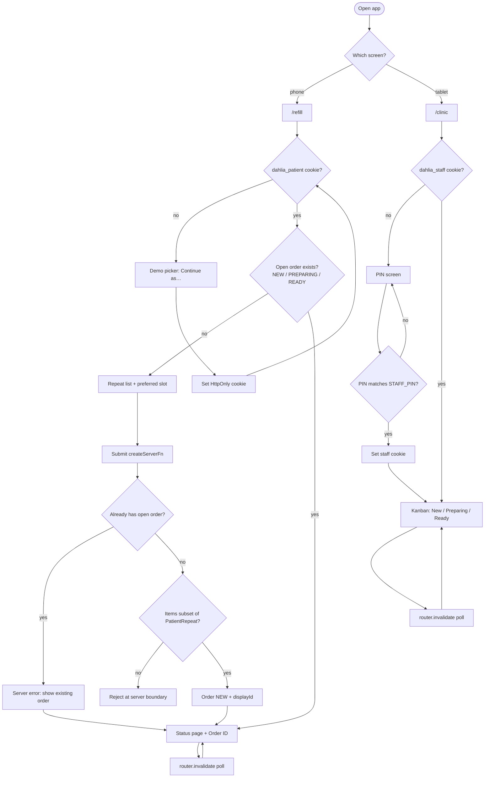
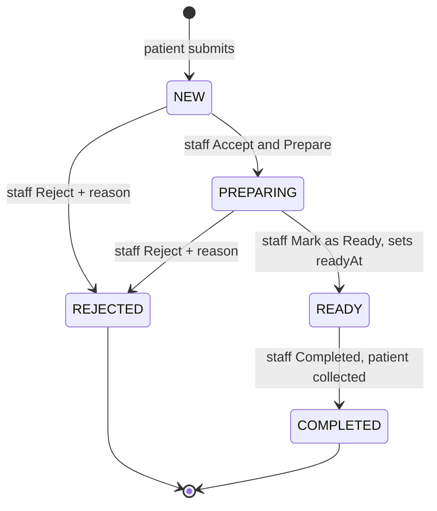
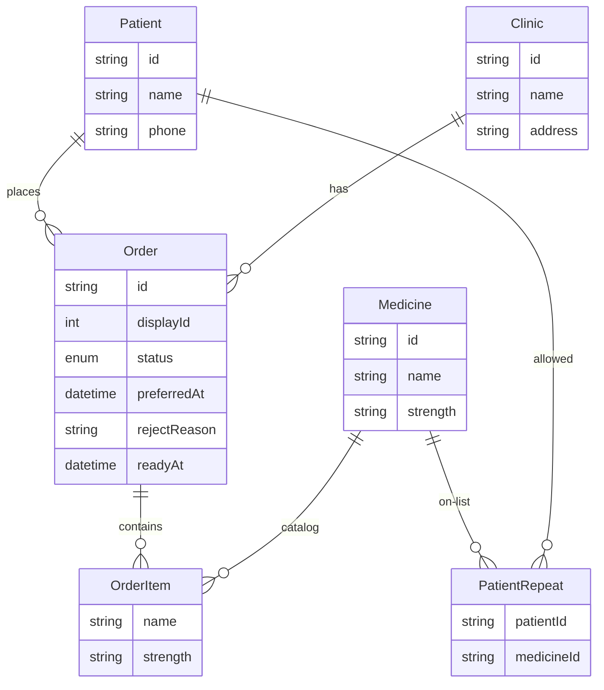

# Architecture Context

## Stack

| Layer     | Technology                                   | Role                                                           |
| --------- | -------------------------------------------- | -------------------------------------------------------------- |
| Framework | TanStack Start (React 19) + TypeScript       | Routes, SSR loaders, `createServerFn` for all DB/server logic  |
| UI        | Tailwind CSS v4                              | Styling. Product routes hide the marketing Header/Footer       |
| Auth      | HttpOnly cookies via `getCookie`/`setCookie` | Demo patient session + staff PIN session. No Clerk, no OTP     |
| Database  | Prisma + PostgreSQL                          | All persistent data. No blob or file store                     |
| Seed      | `prisma/seed.ts`                             | Demo patients, medicines, repeat lists, one clinic (Selayang)  |

## System Boundaries

- `src/routes/` — File routes only. No Prisma imports. Route files call server functions from `src/lib/refill/`
- `src/lib/refill/` — All server logic: session helpers, order status machine, `createServerFn` handlers for patient and staff actions
- `src/db.ts` — Prisma client singleton (already exists). Imported only inside `src/lib/refill/`
- `prisma/` — Schema and seed data
- `src/routes/(marketing)/` — Existing marketing pages at `/`. Unmodified
- `src/routes/refill/` — Patient app routes (`/refill`)
- `src/routes/clinic/` — Staff app routes (`/clinic`)

Marketing chrome (Header, Footer, theme toggle) must not render on `/refill` or `/clinic` routes. Suppress it using the same `useMatch` pattern already in `src/routes/__root.tsx`.

## Implementation progress

Lime = done. Sand = not started. Keep this in sync with `context/progress-tracker.md`.

## System Shape

One process. Patient and clinic are route groups that call the same server function layer. The clinic Kanban and the patient status page refresh via `router.invalidate()` on a polling interval — no websockets.

### Request path

### Route logic

- `/refill` — No `dahlia_patient` cookie → demo patient picker ("Continue as…"). Cookie present + no open order → request form. Cookie present + open order → status page (Order ID, WhatsApp-style preview when status is `READY`)
- `/clinic` — No `dahlia_staff` cookie → PIN screen. Cookie present → Kanban board

### Patient vs clinic walkthrough

### Order status machine

Illegal moves (for example READY → PREPARING, COMPLETED → anything) are rejected by the status machine in `src/lib/refill/`. Status never moves backward.

When status is `READY`, the patient UI shows a WhatsApp-style preview. Nothing is sent (no Twilio, no WhatsApp Business API).

## Storage Model

**PostgreSQL only.** No file or blob storage. The WhatsApp "ready" message is UI derived from `Order.status === READY` and `readyAt`; it is not a separate table or outbound call.

### Data relationships

### Models

**Clinic**
- `id`, `name`, `address`
- One seeded row (Klinik Dahlia Selayang). Orders reference it so multi-clinic support can be added later without rewriting the order table.

**Patient**
- `id`, `name`, `phone`
- No password. Demo login selects a patient by id from the picker.
- Seed uses stable ids (`patient_siti`, `patient_ahmad`, `patient_mei`) so later units can reference them without looking up by name.

**Medicine**
- `id`, `name`, `strength` (e.g. `Amlodipine`, `5mg`)
- Catalog of available medicines.

**PatientRepeat**
- Join between `Patient` and `Medicine`
- Defines which medicines a patient is allowed to request. No entry = no access to that medicine.

**Order**
- `id` — cuid (internal primary key)
- `displayId` — unique integer, public-facing Order ID, seeded from 1042
- `patientId`, `clinicId`
- `status` — enum: `NEW | PREPARING | READY | COMPLETED | REJECTED`
- `preferredAt` — DateTime, patient's preferred collection slot (preference only, not a booking)
- `rejectReason` — nullable String, set when staff rejects
- `readyAt` — nullable DateTime, set when staff marks Ready (used in the WhatsApp-preview copy)
- `createdAt`, `updatedAt`

**OrderItem**
- `id`, `orderId`, `medicineId`
- Snapshot fields: `name`, `strength` (copied from Medicine at submit time so catalog edits do not alter historical orders)

## Auth and Access Model

- `dahlia_patient` cookie — set to the patient's `id` after the demo picker. Patient server functions read this cookie and scope all reads/writes to that patient's data only.
- `dahlia_staff` cookie — set to a boolean flag after the entered PIN matches `STAFF_PIN` from the server environment (never sent to the client). Staff server functions require this cookie and can act on any order.
- Logout clears the relevant cookie only.
- Marketing routes at `/` remain fully public. No cookie is required or inspected.
- No cross-contamination: patient functions never accept a staff cookie as identity, and vice versa.

## Invariants

1. **One open order per patient.** A patient may have at most one order in `NEW`, `PREPARING`, or `READY` at any time. Enforced in PostgreSQL with a partial unique index on `Order.patientId` for those statuses (see feature spec 01). Submitting a new request when one is open is also a server-level error; the patient route shows the existing order instead of the form.
2. **Repeat list only.** Order items must be a non-empty subset of that patient's `PatientRepeat` entries. Submitting a medicine not on the repeat list is rejected at the server function boundary.
3. **Strict status transitions.** Status may only move along the defined graph: `NEW → PREPARING`, `NEW → REJECTED`, `PREPARING → READY`, `PREPARING → REJECTED`, `READY → COMPLETED`. Any other transition is rejected. Status never moves backward.
4. **displayId is unique and permanent.** It is assigned at creation and never reassigned or reused.
5. **No Prisma on the client.** Route components and client-side code never import from `src/db.ts` or `src/generated/prisma`. All database access lives in `createServerFn` handlers inside `src/lib/refill/`.
6. **No outbound notifications.** The "ready" WhatsApp message is rendered UI only. No Twilio, no WhatsApp Business API, no SMS is sent in this demo.
7. **Marketing chrome is absent on product routes.** `/refill` and `/clinic` must not render the marketing Header or Footer.
