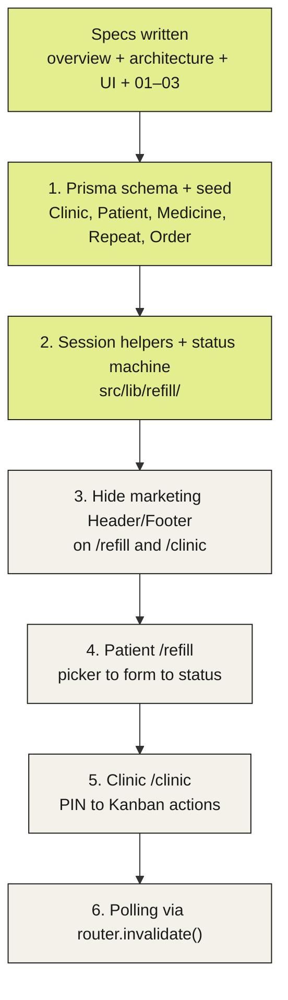

# Progress Tracker

Update this file after every meaningful implementation
change.

## Build progress

Lime = done. Sand = not started. Runtime flows (patient/clinic walkthrough, status machine, data model) live in `context/architecture.md`.

## Current Phase

- Session helpers (02) implemented. Spec 03 written. Next: hide marketing Header/Footer on `/refill` and `/clinic`.

## Current Goal

- Implement `context/feature-specs/03-hide marketing headers/overview.md` — stub `/refill` and `/clinic`, suppress marketing chrome, scope `.product-app` tokens.

## Completed

- `context/project-overview.md` — Dahlia Refill MVP definition: patient `/refill`, clinic `/clinic`, demo accounts, simulated WhatsApp, reject path, marketing site unchanged at `/`.
- `context/architecture.md` — one TanStack Start process, HttpOnly cookies, Prisma models, one-open-order rule, strict status machine. Flowcharts: implementation progress, request path, patient/clinic walkthrough, status machine, ER diagram.
- `context/ui-context.md` — Ro-inspired light-only product UI (lime/slate/sand, monumental Order ID, black pills, no shadcn). Marketing `/` frozen this pass.
- `context/code-standards.md` — skipped by request. Use architecture invariants and existing repo conventions until filled.
- Homepage bento cards: primary care, Pulse TPA, and training now use `/primarycare.JPG`, `/pulse.jpg`, and `/training.png`. Portrait card auto-slides `/kedai.jpeg`, `/image2.png`, and `/image3.png` (full-bleed `object-cover`, 4.5s crossfade, hover pause, reduced-motion off).
- Homepage mobile trust-badge strip is a continuous CSS marquee (duplicated track, 28s loop, reduced-motion off).
- Homepage header wordmark is `/logo.png` instead of the “DMG” text.
- `context/feature-specs/01-data layer/overview.md` — first feature spec: schema, constraints, locked seed cast, Todo demo cleanup. No UI or `src/lib/refill/` in that unit.
- Data layer 01 implemented: refill Prisma models + migration (`displayId` from 1042, one-open-order index), demo seed (Selayang / Siti / Ahmad / Mei), `/demo/prisma` and Header Demos dropdown removed.
- `context/feature-specs/02-session helpers/overview.md` — second feature spec: `dahlia_patient` / `dahlia_staff` HttpOnly cookies, `STAFF_PIN` env, login/logout server functions, pure status machine. No product routes in that unit.
- Session helpers 02 implemented: `src/lib/refill/` cookies, `requirePatient` / `requireStaff`, six session `createServerFn`s, `applyStaffAction`. `STAFF_PIN` in `.env.local`. No product routes.
- `context/feature-specs/03-hide marketing headers/overview.md` — third feature spec: hide Header/Footer/theme toggle on `/refill` and `/clinic`, stub canvases, `.product-app` token scope. No picker/PIN/Kanban in that unit.

## In Progress

- None.

## Next Up

1. Implement hide marketing chrome (`context/feature-specs/03-hide marketing headers/overview.md`).
2. Patient `/refill`: picker → request form → status (including simulated WhatsApp on Ready).
3. Clinic `/clinic`: PIN → Kanban (New / Preparing / Ready) with Accept, Ready, Complete, Reject.
4. Polling via `router.invalidate()` so the two screens stay in sync for the demo walkthrough.

## Open Questions

- None blocking the next unit. Demo patient ids are stable (`patient_siti`, `patient_ahmad`, `patient_mei`).
- `STAFF_PIN` is env-only (`1234` in `.env.local`).

## Architecture Decisions

- Single app, two route groups (`/refill`, `/clinic`). No separate API server, no websockets, no Clerk, no TanStack Query for this MVP.
- Demo auth: HttpOnly cookies. Patient = “Continue as…” picker. Staff = PIN from env, never sent to the client.
- One open order per patient (`NEW | PREPARING | READY`). Submit is rejected if one exists; `/refill` shows that order instead.
- Order items must be a non-empty subset of `PatientRepeat`. No free-text medicines.
- Status graph only: `NEW → PREPARING | REJECTED`, `PREPARING → READY | REJECTED`, `READY → COMPLETED`.
- `displayId` unique integer, seeded from 1042. WhatsApp “message” is UI derived from `READY` + `readyAt`, not a sent message.
- Product chrome is a slim Ro-like bar, not the marketing Header. Tokens apply to product routes; marketing homepage is frozen.

## Session Notes

- Local DB for this pass is Prisma Postgres via `npx prisma dev --detach --name dahlia-refill` (TCP on port 51214). `.env.local` `DATABASE_URL` and `STAFF_PIN=1234` point there; start that server before `db:migrate` / `db:seed`.
- Session cookies: `dahlia_patient` (patient id) and `dahlia_staff` (`"1"`). HttpOnly, path `/`, SameSite Lax, Secure in production only, 1-day maxAge. PIN never stored in a cookie.
- Seed wipes refill tables, resets `Order_displayId_seq` to 1042, and inserts 1 clinic / 3 patients / 5 medicines / 7 repeats / 0 orders. Runnable twice.
- Homepage mobile trust-badge strip loops as a CSS marquee. Desktop list is still static.
- Context files to read before coding: `project-overview.md`, `architecture.md`, `ui-context.md`. Skip `code-standards.md` (still a template).
- Visual reference is Ro (ro.co) with Dahlia lime `#E4EE8F`, not Ro coral. User rule still applies: no equal 3-column SaaS grids; clinic Kanban columns are uneven.
- `ai-workflow-rules.md` is still a template.
